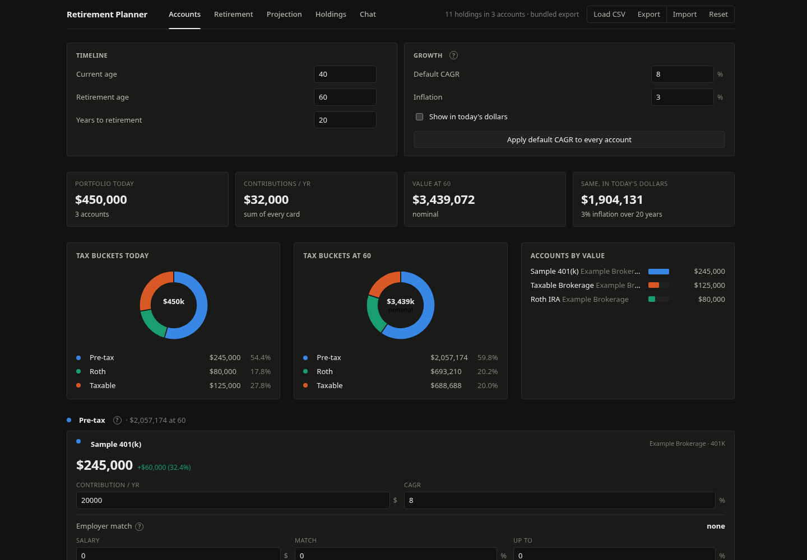
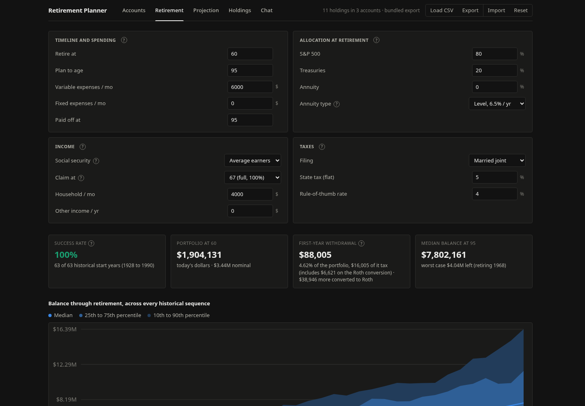

# Retirement Planner

A browser app that reads a brokerage holdings export and asks one question: can this plan retire at the age I picked. It replays the plan from every start year since 1928, using that stretch's actual S&P 500 and 10-year Treasury returns and inflation, and a chat tab lets a language model answer "what if" questions by calling the planner's own functions instead of doing math itself.

Try it on the sample data at https://retirement-planner-5329.web.app. It is a static page: a CSV you load and the inputs you change stay in your browser's localStorage, and only the Chat tab sends anything out, to OpenRouter with your own key.




## Sample data

All data shipped in this repo is synthetic. `src/data/holdings.csv` is a made-up portfolio of round share counts in broad index ETFs and two large-cap stocks, held in three accounts named "Sample 401(k)", "Roth IRA" and "Taxable Brokerage" at "Example Brokerage". `src/data/defaults.json` is a made-up set of inputs (age 40, retire at 60, $6,000 a month of spending). None of it is anyone's real account.

## Run it

```sh
npm install
npm run dev      # opens on the sample data
npm test         # vitest: model math, the CSV parser, the chat tool loop
npm run build    # typecheck and production build
```

To plan over a real export, put it in `private/` (gitignored) and point the build at it:

```sh
PLANNER_HOLDINGS=private/holdings.csv PLANNER_DEFAULTS=private/defaults.json npm run dev
```

Both variables are optional and independent. They are read in `vite.config.ts` and ignored under vitest, so the tests always run on the sample. The Load CSV button in the header also swaps holdings at runtime; that copy stays in the browser's localStorage.

The CSV format is a 10-column export: ticker, name, shares, current value, cost basis, unrealized gain, account, broker, account type (401K, 403B, Roth, Normal Brokerage) and tax treatment (Pre-Tax, Post-Tax, Normal). The header only names the first eight.

## What it does

- **Accounts**: a card per account with its contribution, growth rate and employer match, and tax-bucket donuts today and at retirement.
- **Retirement**: the success rate across every historical start year, a fan chart of balances, where each year's spending comes from, and a grid of success by spending and retirement age. The inputs:
  - variable expenses that keep up with inflation, and fixed expenses like a mortgage that stay the same in dollars until a payoff age
  - an allocation at retirement across the S&P 500, 10-year Treasuries and a life annuity, with a table comparing allocations
  - social security by earnings level and claiming age, federal tax with 2025 brackets, and a flat state rate
  - a withdrawal strategy (fill the 12% or 22% bracket and convert the rest to Roth, taxable first, and others) and an optional Roth conversion ladder
- **Projection**: balances by tax bucket and by money source until retirement.
- **Holdings**: positions grouped by category and tax treatment.
- **Chat**: what-if questions answered by the planner's own functions (below).
- **`simple/`**: a one-screen version that asks "When can I stop working?" and answers with one age from four sliders.

## How it works

Vite and TypeScript, vanilla DOM, hand-drawn SVG charts, no runtime dependencies.

- `src/model.ts` holds growth, federal tax with 2025 brackets, social security taxation, withdrawal rules (59.5 penalty, Roth basis, rule of 55, required minimums from 75), Roth conversions and annuity payouts.
- `src/sim.ts` replays retirement from each start year in `src/data/history.ts` (S&P 500, 10-year Treasury and CPI series typed from the Damodaran and BLS tables) and returns a success rate and percentile bands.
- `src/plan.ts` is the plan evaluator. `withOverrides` applies a scenario, evaluates, and restores the live settings. All three files are pure and tested.
- The Chat tab talks to OpenRouter with a key you paste in; it lives only in localStorage. The model gets ten tools (`src/chat/tools.ts`: `get_state`, `get_holdings`, `run_scenario`, `sweep`, `compare`, `solve`, `get_sequence`, `get_first_year`, `show_on_chart`, `apply_scenario`). Every tool calls the evaluator, and the UI draws its cards from the tool results, never from the model's prose. The model is told not to compute numbers. Using the Chat tab sends your plan and holdings to the model you pick.

The tool loop is tested without a network: `tests/chat.test.ts` mocks `fetch` with a streamed response that splits a tool call across chunks, checks the call is reassembled and run, the result goes back to the model, a 502 is retried, and a 401 is not. The same file runs each tool against the evaluator (`solve`, for example, checks that the answer it finds is the boundary: $5k more spending drops below the target success rate).

## How it was built

I built the first version over two days, September 20 and 21, 2026, and kept extending it through the end of the month, with coding agents writing most of the code under my direction. I decided what it should answer, which strategies and presets to offer, and how it should look; `docs/taste.md` is the list of rules that came out of my screenshots and notes. The agents wrote the model, simulator, tools and UI. What verified it: `npm test` (vitest across the tax and withdrawal math with hand-checked figures in the comments, the simulator, the CSV parser and the chat tool loop), `npm run build` for the typecheck, and clicking through the five tabs in a browser. The Chat tab has been run against a mocked stream, not yet against a live key.

## License

MIT. See `LICENSE`.
