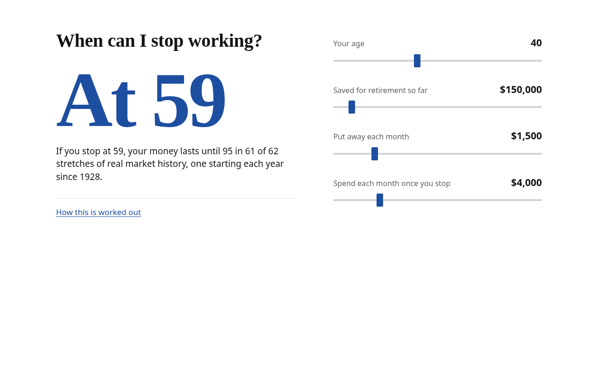
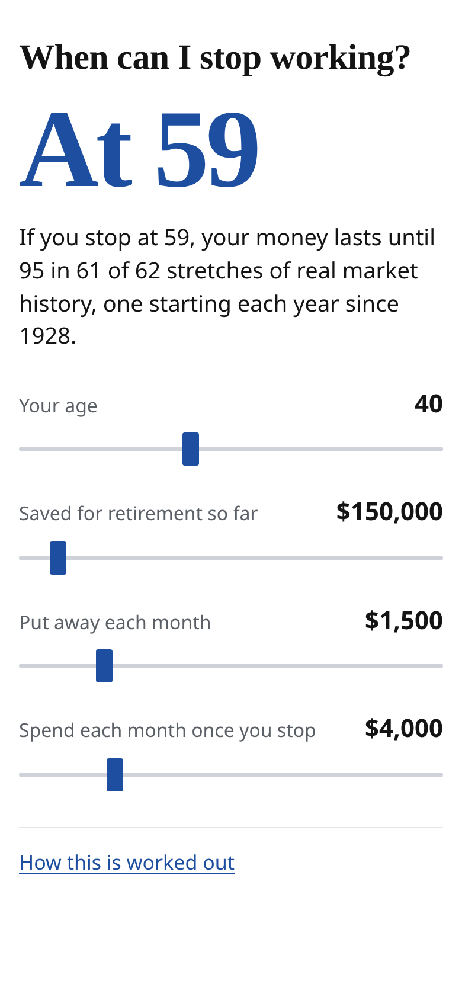

# When can I stop working?

A one-screen version of the retirement planner for people who do not want a
planner. It asks one question, answers with one age, and has four sliders:
your age, what you have saved, what you put away each month, and what you
would spend each month once you stop.




## How it relates to the full planner

The full planner (the app at the repo root) reads a holdings export and
exposes every lever: accounts, tax buckets, withdrawal strategies, Roth
conversions, social security presets, a chat tab. This page keeps the same
engine and fixes every lever but four.

- `answer.ts` is the only maths here. It grows savings with `futureValue`
  from `src/model.ts`, then replays retirement from every start year with
  `simulate` from `src/sim.ts`, the same historical-sequence simulation the
  Retirement tab uses, including 2025 federal tax, the early-withdrawal
  penalty and the rule of 55. It solves for the earliest age at which the
  money lasts until 95 in at least 9 of 10 of those runs.
- It never imports `src/state.ts` or `src/plan.ts`, which read the holdings
  and defaults files. Its inputs are the sample values in `answer.ts`, and
  `tests/simple.test.ts` walks the page's imports and fails if either file,
  or any CSV, JSON or `private/` path, becomes reachable.
- The fixed assumptions (60/40 stocks and bonds, bonds at 1% above
  inflation, $2,000 a month of Social Security from 67, one person, no state
  tax, savings in a 401(k)-style account) are listed on the page under "How
  this is worked out", filled from the same constants the maths uses.

## Run it

```sh
npm run simple         # dev server for this page
npm run simple:build   # one self-contained file: simple/dist/index.html (about 21 KB)
npm test               # includes tests/simple.test.ts
```

The built file opens straight from disk; nothing loads from the network.

`verify.mjs` is the browser check (console errors, each slider changes the
answer, keyboard order, the explanation, no horizontal scroll at 390 wide,
the design rules) and writes the two screenshots in `docs/`. Playwright is
not a dependency of this repo, so point it at any install:

```sh
npm run simple:build
PLAYWRIGHT=/path/to/node_modules/playwright/index.mjs node simple/verify.mjs
```
